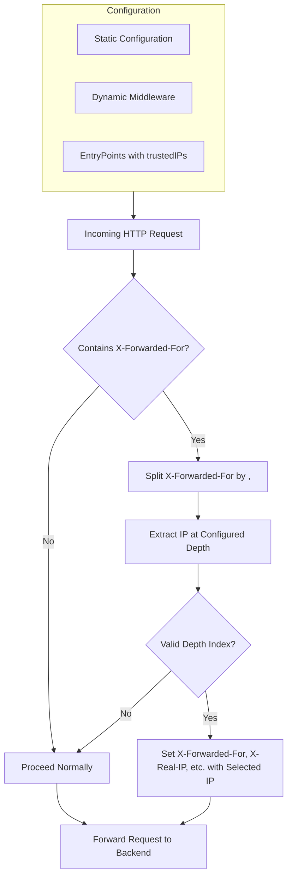

<p align="center"></p>

# Project Specification: Zerodawn XFF Refiner Plugin

## 1. Overview
This project implements **Zerodawn XFF Refiner**, a Traefik plugin that intelligently refines the `X-Forwarded-For` header by extracting a specific IP address based on a configurable index (`depth`). It forces `X-Forwarded-For` to contain only that single IP and sets additional tracking headers like `X-Original-Forwarded-For` and `X-Forwarded-For-Proxy-Protocol`.

## 2. Objectives
- **Ensure backend services receive a single, correct client IP address in XFF**.
- Provide a configurable mechanism (`depth`) to extract the desired IP from the original `X-Forwarded-For` header.
- Preserve the original chain in `X-Original-Forwarded-For`.
- Set `X-Forwarded-For-Proxy-Protocol` and `X-Real-Ip` for compatibility.

## 3. Features
- Parses `X-Forwarded-For` header and splits it into a list of IPs.
- Selects an IP based on the specified `depth` (default: 0).
- Overwrites `X-Forwarded-For` with the selected IP.
- Sets `X-Original-Forwarded-For` with the original value.
- Sets `X-Forwarded-For-Proxy-Protocol` and `X-Real-Ip` with the selected IP.
- Supports both static and dynamic Traefik configurations.



## 4. Use Cases
- Traefik deployed behind multiple proxies (e.g., Cloudflare tunnels, Docker networks).
- Applications that expect `X-Forwarded-For` to contain only the client IP.

## 5. Configuration

### Static Configuration Example:
```yaml
experimental:
  plugins:
    traefik-xff-refiner:
      moduleName: github.com/zerodawncode/traefik-xff-refiner
      version: v0.1.2
```

### Dynamic Middleware:
```yaml
http:
  middlewares:
    xff-refiner:
      plugin:
        traefik-xff-refiner:
          depth: 1
```

## 6. License
This project is licensed under the MIT License.

- Developed and maintained © 2026 Zerodawn
